# PORTUS — Fase 1

## Bitácora de Desarrollo y Evidencias

**Universidad San Carlos de Guatemala — Facultad de Ingeniería**
**Ingeniería en Ciencias y Sistemas — Arquitectura de Computadoras y Ensambladores 2**

---

## 1. Avances realizados

El desarrollo del proyecto se organizó en tres grandes etapas, siguiendo un enfoque incremental de menor a mayor complejidad.

En primer lugar, se trabajó cada componente electrónico de forma aislada en protoboard: lectura de tarjetas RFID, movimiento de servomotores, encendido de semáforos con LEDs, sensores infrarrojos de presencia y pantallas LCD. Cada uno se probó y validó individualmente antes de integrarlo con los demás, verificando que respondiera correctamente a señales de prueba desde el Arduino.

Una vez confirmado el funcionamiento individual de cada módulo, se pasó a la etapa de integración electrónica: se combinaron los componentes en un mismo circuito, ajustando el cableado y el código hasta lograr que el conjunto funcionara de manera coordinada (por ejemplo, que la lectura RFID disparara correctamente el cambio de semáforo y la apertura de la talanquera).

En paralelo, se diseñaron e imprimieron en 3D las piezas estructurales de la maqueta: la grúa, las talanqueras de entrada y salida, y los vehículos (camiones) a escala.

Finalmente, se realizó el montaje completo sobre la base de la maqueta: se fijaron las piezas impresas, se distribuyeron los sensores y actuadores en sus posiciones definitivas, y se realizaron las conexiones eléctricas finales entre todos los módulos ya probados.

---

## 2. Integrantes responsables

| Integrante                            | Carné     | Responsabilidad                     |
| ------------------------------------- | --------- | ----------------------------------- |
| Alberto Moisés Gerardo Lémus Alvarado | 202400999 | Código y test de módulos            |
| Jose Javier Quan García               | 202001952 | Armado de grúa y código de la misma |
| Kevin Eduardo Castañeda Hernández     | 201901801 | Talanquera de entrada y salida      |
| Selvin Raúl Chuquiej Andrade          | 202405516 | Diseño de maqueta, diseños 3D       |
| Manuel Orlando Balcarcel Tixta        |           | Construccion de Maqueta y pesaje    |

---

## 3. Fotografías del proceso

**Pruebas de electrónica y piezas impresas en 3D (grúa, camión, talanqueras) antes del montaje:**

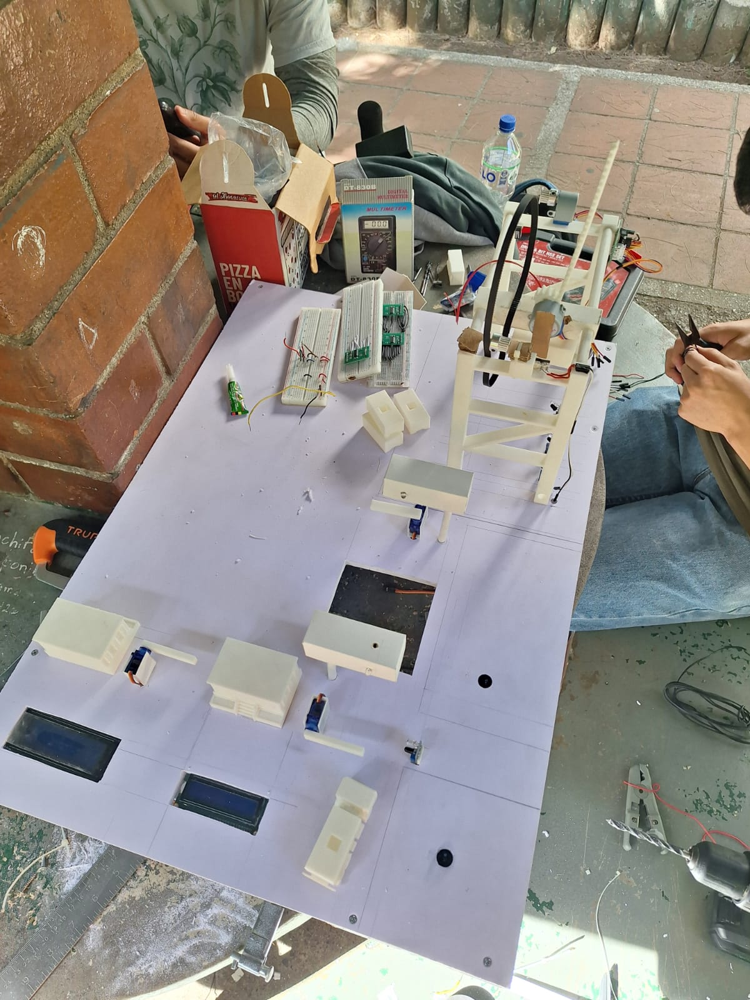

**Montaje de conexiones sobre la base de la maqueta:**

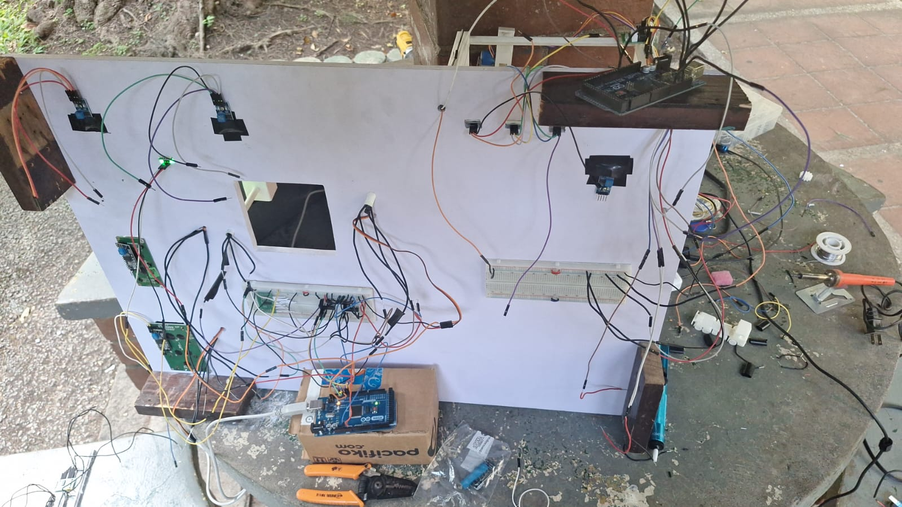

**Estructura de la grúa impresa en 3D, ya montada:**

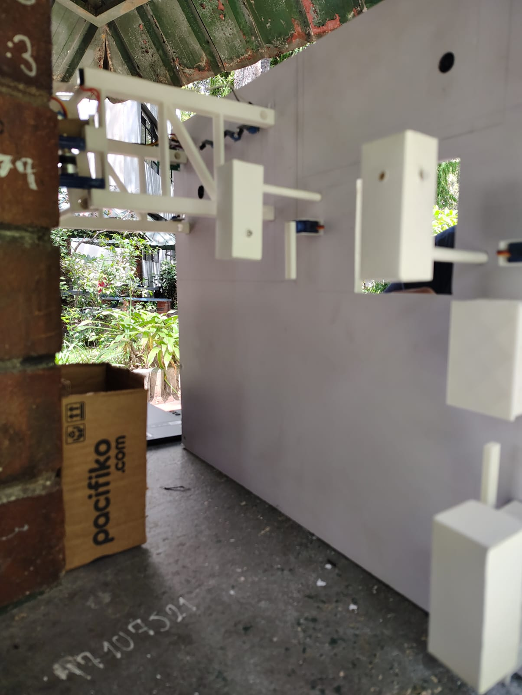

**Zona de trabajo durante el proceso de soldadura y armado de cables:**

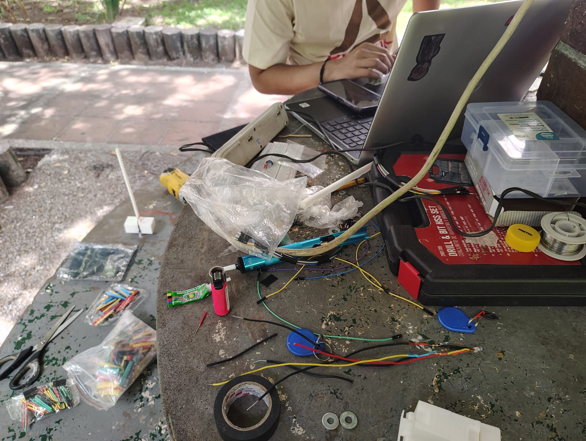

**Camión impreso en 3D, pieza a escala para la maqueta:**

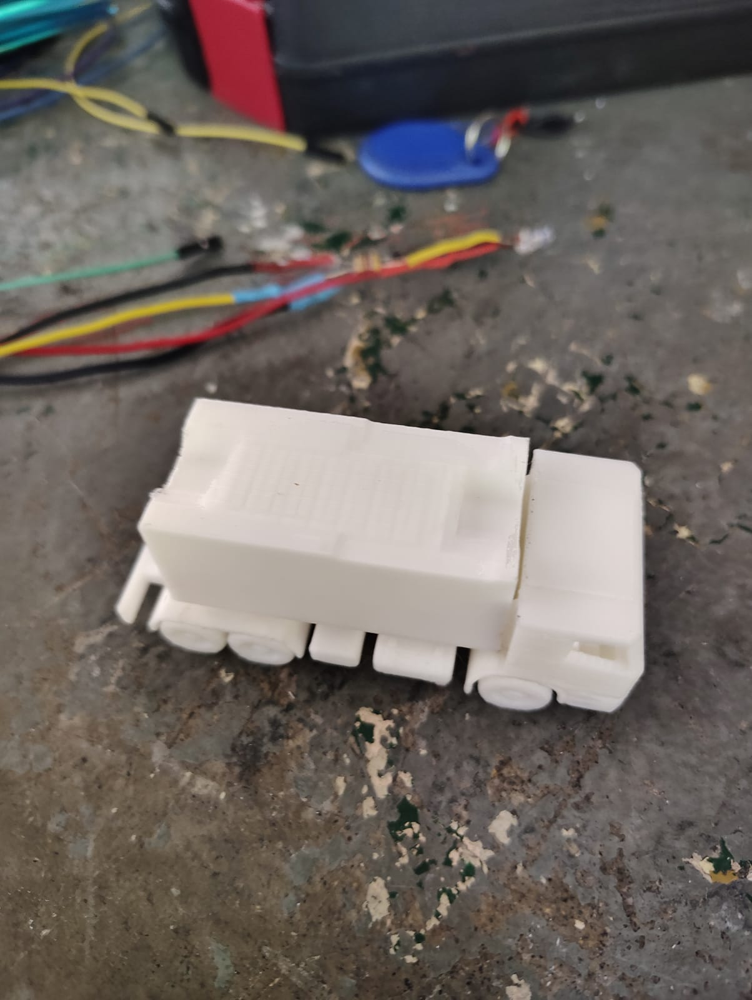

**Arduino Mega con las conexiones de los distintos módulos:**

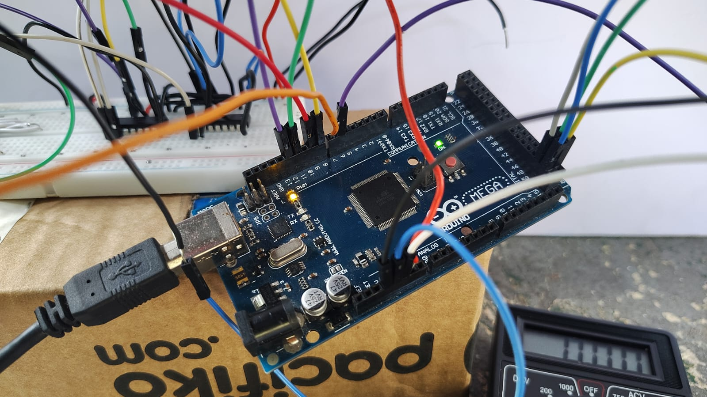

**Prueba de la estructura de la grúa con sus motores:**

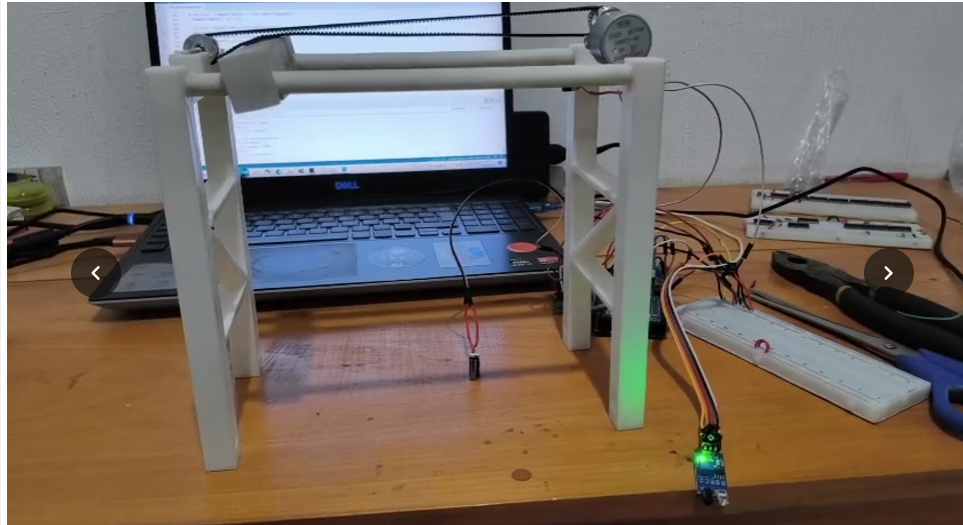

**Prueba de la pantalla LCD de garita (primera versión):**

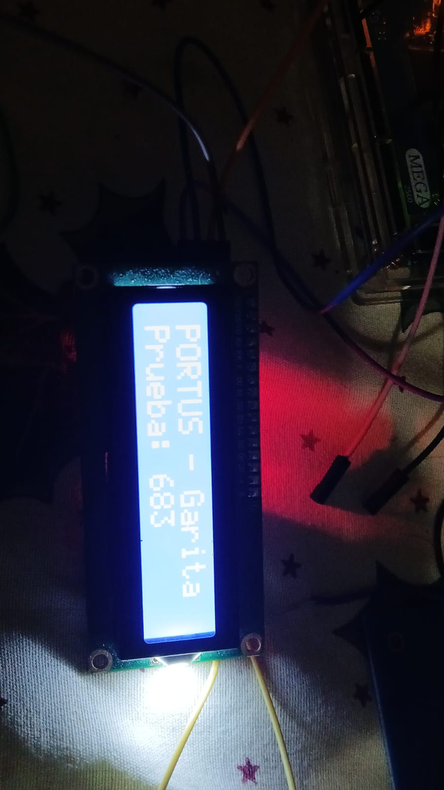

**Prueba de la pantalla LCD de garita junto al semáforo en protoboard:**

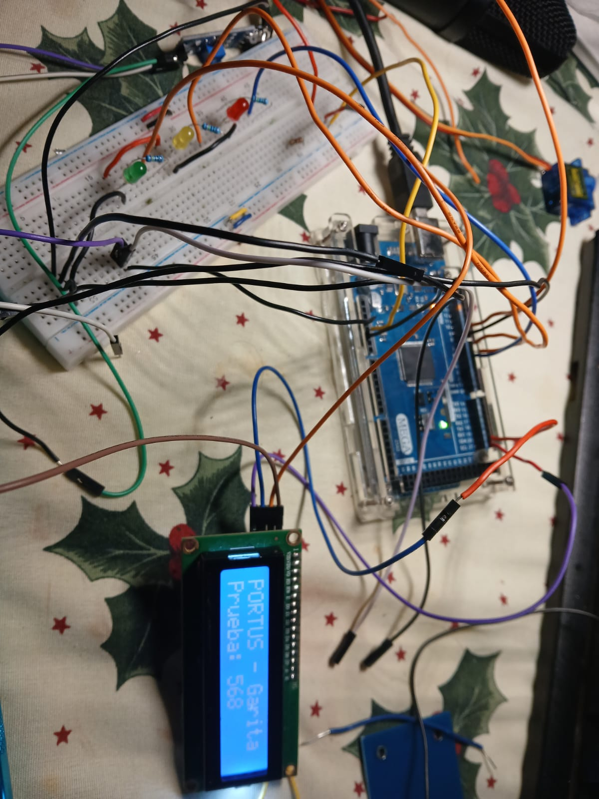

**Prueba del semáforo con LEDs en protoboard:**

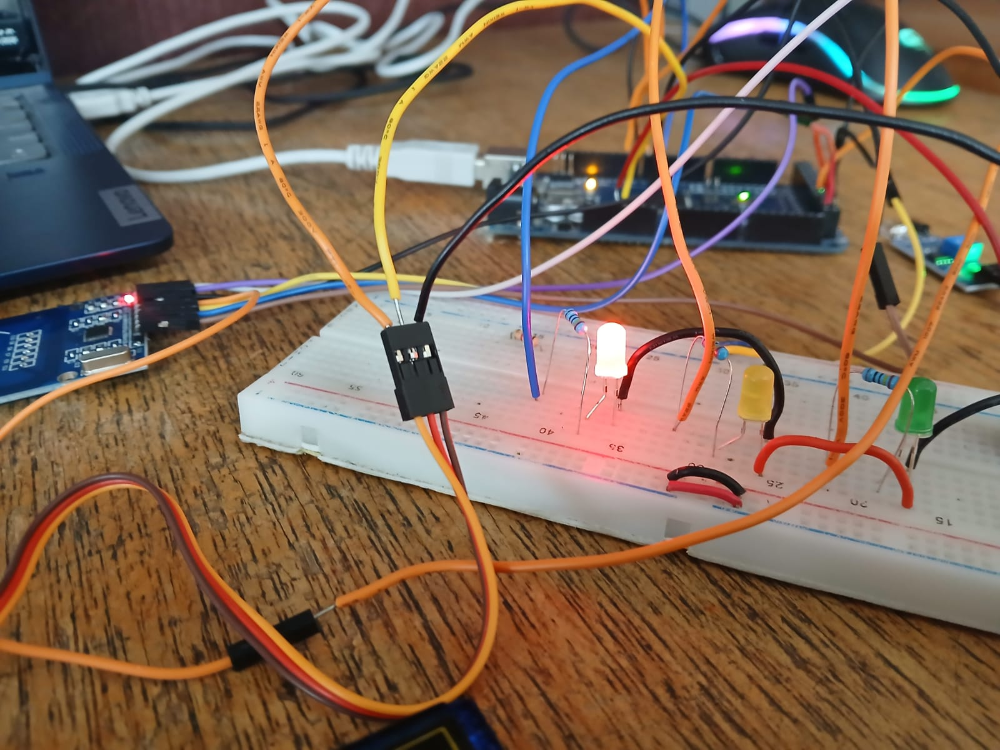

**Prototipo completo del semáforo con sensores y servomotor de la talanquera:**

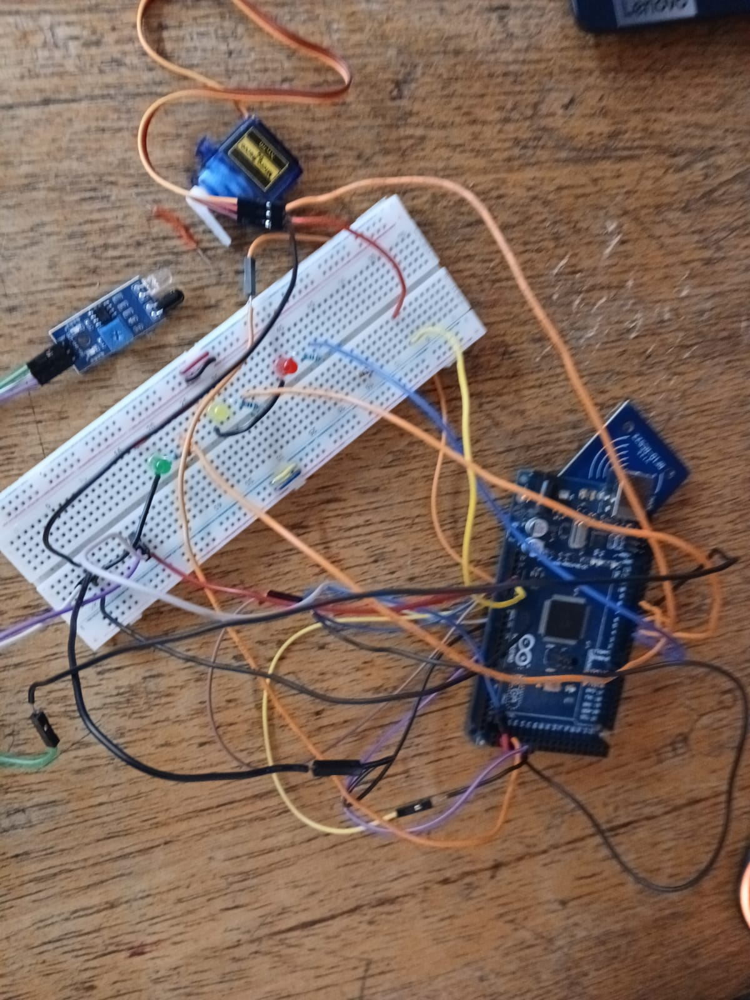

**Servomotor SG90 utilizado para la talanquera:**

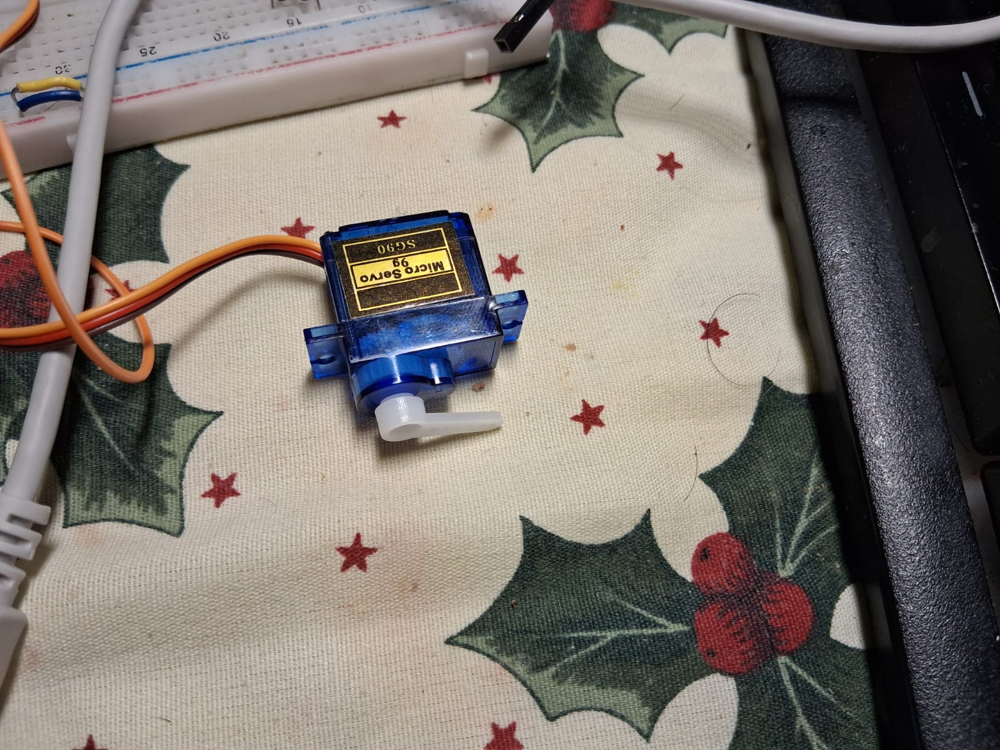

**Prueba del sensor infrarrojo de detección:**

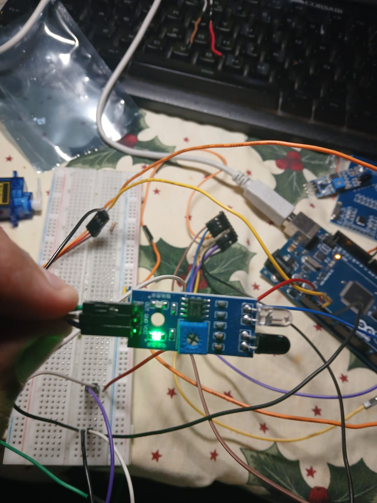

**Prueba del lector RFID con tarjeta de identificación:**

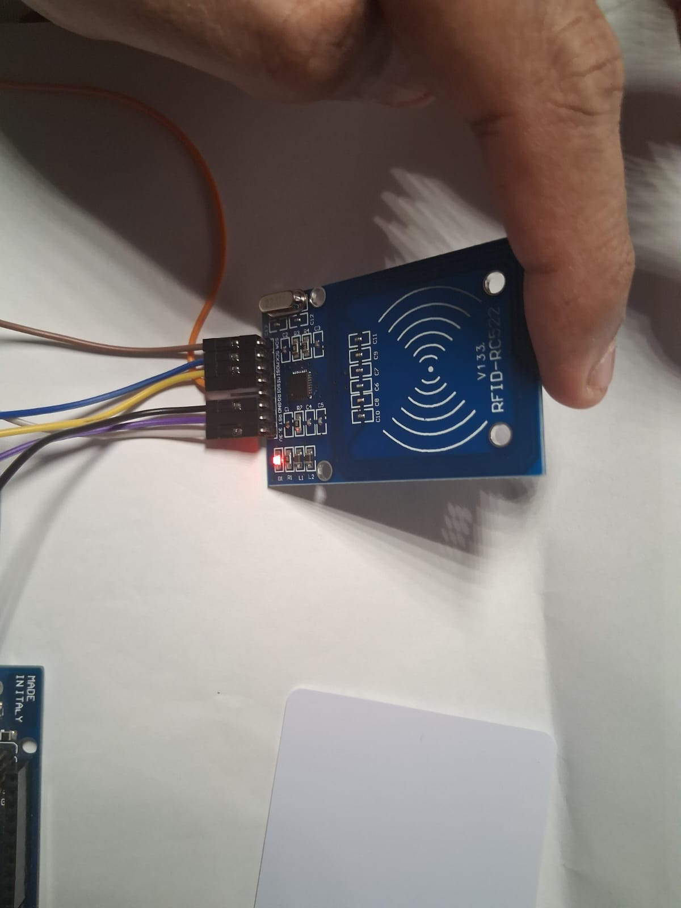

**Avance general de la maqueta con todos los módulos en proceso de integración:**

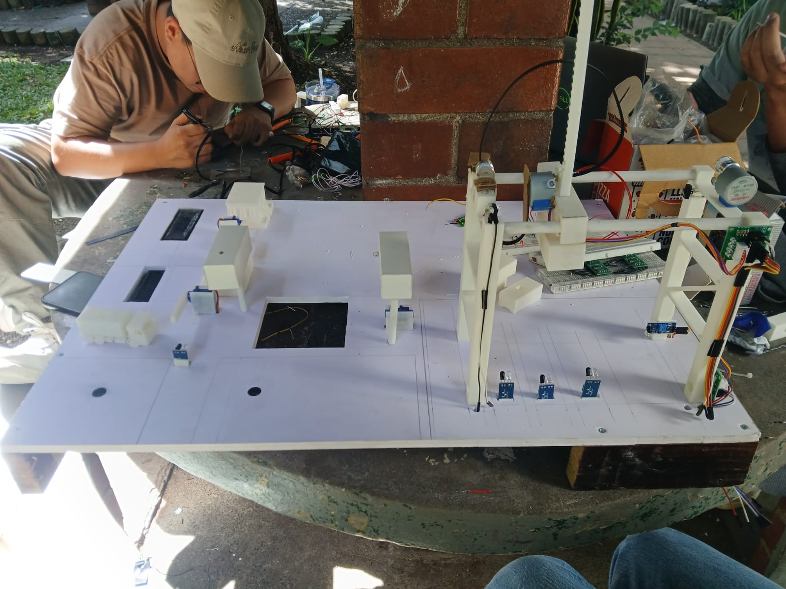

---

## 4. Problemas encontrados

Durante el desarrollo se identificaron dos problemas principales:

- **Calibración de la grúa para filas y columnas:** ajustar el movimiento de la grúa para que se detuviera con precisión en cada una de las posiciones (filas y columnas) donde debían colocarse los paquetes representó un reto, ya que pequeñas desviaciones en el recorrido afectaban la exactitud del posicionamiento.

- **Reconocimiento intermitente del sensor RFID:** el sensor encargado de identificar las tarjetas dejó de reconocerlas correctamente después de cierto tiempo de uso, lo cual obligó a revisar tanto las conexiones como el código de lectura para identificar la causa.

---

## 5. Cambios de diseño

El diseño inicial de la grúa contemplaba un mecanismo de traslación que resultó ineficiente en términos de movilidad y precisión. Por esta razón, se optó por rediseñar el sistema de traslación utilizando una banda (cinta) que facilita el desplazamiento de la grúa a lo largo del riel, mejorando la fluidez del movimiento respecto al diseño original.

---

## 6. Resultados de pruebas

Los resultados obtenidos hasta el momento son aceptables, aunque no perfectos. El movimiento de la grúa funciona, pero aún puede optimizarse para lograr un recorrido más preciso y eficiente. Estos son algunos de los puntos identificados como oportunidades de mejora conforme el proyecto avance; con más tiempo de ajuste y pruebas adicionales, se espera acercarse a los resultados deseados en cuanto a precisión y fluidez de movimiento.

---

## 7. Calibraciones

Se realizaron calibraciones principalmente a nivel de código, enfocadas en dos aspectos:

- Ajuste de la detección de los puntos finales de movimiento de la grúa en los ejes X y Y, para que el sistema identificara correctamente cuándo detener el desplazamiento en cada eje.
- Ajuste del reconocimiento en las talanqueras, para mejorar la respuesta del sistema ante la detección de vehículos y tarjetas RFID.

---

## 8. Correcciones mecánicas y electrónicas

Las correcciones realizadas incluyen las ya mencionadas en los puntos anteriores:

- Corrección del sistema de traslación de la grúa (cambio a banda/cinta).
- Ajustes en la detección de posiciones finales de movimiento (ejes X y Y).
- Ajustes en el reconocimiento de las talanqueras (sensores y lectura RFID).

Adicionalmente, se realizaron mejoras al diseño general de la maqueta con el objetivo de hacerla más eficiente en su funcionamiento y montaje.
