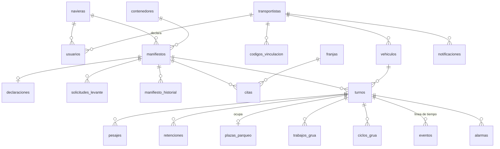

# PORTUS Fase 2 — Modelo de datos (SQLite)

Esquema completo: [`database/schema.sql`](../database/schema.sql). Se crea solo al iniciar el servidor
o con `python run.py init-db --demo`. Archivo: `F2/database/portus.db` (no se sube a git).

| Tabla | Para qué | Columnas clave |
|---|---|---|
| `usuarios` | login de los 5 roles | `username`, `password_hash` (nunca texto plano), `rol`, `naviera_id`, `transportista_id`, `activo` |
| `navieras` / `transportistas` | entidades dueñas | `codigo`; transportista: `chat_id` (bot), `vinculado_en` |
| `codigos_vinculacion` | /vincular | `codigo` (6), `expira_en` (+60 min), `usado_en` (un solo uso) |
| `vehiculos` | camiones con RFID | `rfid_uid`, `placa`, `tara_g` |
| `contenedores` | catálogo e inventario | `ubicacion` (FUERA/VEHICULO/PATIO/GRUA), `posicion`, `nivel`, `ingreso_en`, `remociones` |
| `posiciones_patio` + vista `v_patio` | 6 posiciones × 2 niveles | `contenedor_n1`, `contenedor_n2`, `bloqueada`, `reservada_turno_id`, `estado` (vista) |
| `manifiestos` | declaración de la naviera | `tipo`, `peso_declarado_g`, `tolerancia_pct`, `estado_documental`, `canal`, `estado_operativo`. Índice único: 1 pendiente por contenedor |
| `manifiesto_historial` | trazabilidad (Corregir guarda el valor anterior) | `accion`, `valor_anterior`, `valor_nuevo` |
| `declaraciones` | declaración de mercancías | `numero_declaracion` (único), `regimen`, `descripcion` (≥10), `valor_declarado` |
| `solicitudes_levante` | bandeja de la autoridad | `estado`, `canal`, `motivo` |
| `observaciones_documentales` | notas del agente | `texto` |
| `franjas` / `citas` | agenda de 15 min, 2 por franja | `inicio`, `fin`, `bloqueada` / `estado`, `dentro_ventana`, `recordatorio_enviado`. Índice único: 1 cita vigente por contenedor |
| `turnos` | operación física | `estado` (10 estados), `estado_previo`, `estacion`, pesos, `posicion_asignada`, `creado_en`, `cerrado_en`. Índice único: 1 turno activo por vehículo |
| `intentos_ingreso` | ingresos rechazados (no crean turno) | `rfid_uid`, `causa` |
| `pesajes` | cada medición | `peso_bruto_g`, `peso_neto_g`, `esperado_g`, `diferencia_pct`, `dentro_tolerancia` |
| `plazas_parqueo` | 3 plazas lógicas | `turno_id`, `retencion_id`, `ocupada_desde`, `liberacion_pendiente` |
| `retenciones` | RT01–RT06 | `codigo`, `causa`, `rol_facultado`, `plaza`, evidencia de peso, `resolucion`, `motivo`, `resuelta_por` |
| `trabajos_grua` / `ciclos_grua` / `fallas_grua` | cola generada por el servidor / ejecución real / fallas | `tipo` (DEPOSITO/RETIRO/REMOCION), `duracion_ms`, `distancia_mm`, `resultado` |
| `alarmas_catalogo` / `alarmas` | AL01–AL14 | `reconocida`, `reconocida_por`, `comentario`, `condicion_activa` |
| `comandos` | comandos remotos | `mensaje_id`, `comando`, `estado`, `causa_rechazo` |
| `eventos` | línea de tiempo | `turno_id`, `origen` (controlador/servidor/usuario), `descripcion`, `datos_json`, `seq`, `mensaje_id` (único → sin duplicados al reconciliar) |
| `telemetria` | latidos | `cola_espera` (métrica de fila), `datos_json` |
| `estado_sistema` | clave/valor | `enlace`, `modo`, `ultimo_latido`, `ultimo_seq`, `politica_patio`, `grua`, `aguja` |
| `notificaciones` | bandeja de salida del bot | `transportista_id`, `tipo`, `mensaje`, `estado` (PENDIENTE/ENVIADA/ERROR) |
| `reportes` | corridas guardadas | `etiqueta`, `desde`, `hasta`, `metricas_json` |

## Cálculo de las 8 métricas (`services/metricas.py`)
| Métrica | Fórmula |
|---|---|
| Remociones por contenedor retirado | ciclos `REMOCION` OK ÷ turnos `RETIRO` cerrados |
| Ciclos de grúa por operación completada | ciclos OK (sin referenciado) ÷ turnos cerrados |
| Distancia total de la grúa | Σ `ciclos_grua.distancia_mm` |
| Tiempo promedio de camión | promedio `cerrado_en − creado_en` de turnos Cerrados |
| Tiempo promedio de retención | promedio `resuelta_en − creada_en` |
| Longitud máxima de fila | máx. `telemetria.cola_espera` (viene en el latido) |
| % citas cumplidas en ventana | citas con `dentro_ventana = 1` ÷ citas del periodo (sin canceladas) |
| Retenciones por causa y resolución | `GROUP BY causa, resolucion` |
